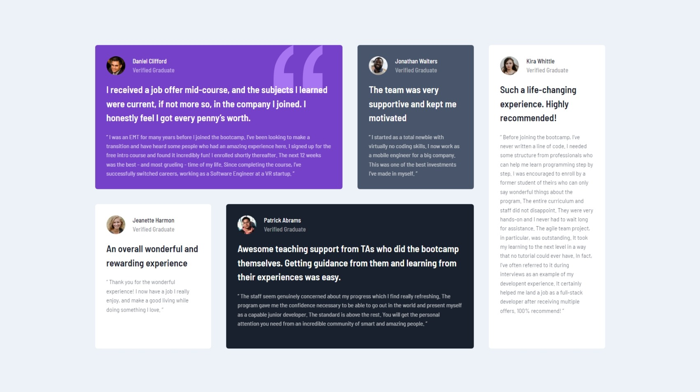

# Frontend Mentor - Testimonials grid section solution

This is a solution to the [Testimonials grid section challenge on Frontend Mentor](https://www.frontendmentor.io/challenges/testimonials-grid-section-Nnw6J7Un7). Frontend Mentor challenges help you improve your coding skills by building realistic projects. 

## Table of contents

- [Overview](#overview)
  - [The challenge](#the-challenge)
  - [Screenshot](#screenshot)
  - [Links](#links)
- [My process](#my-process)
  - [Built with](#built-with)
- [Author](#author)

## Overview

### The challenge

Users should be able to:

- View the optimal layout for the site depending on their device's screen size

### Screenshot

Desktop

Mobile

### Links

- [Solution URL](https://github.com/thamu-acn/testimonials-grid-section-main)
- [Live site URL](https://thamu-acn.github.io/testimonials-grid-section-main/)

## My process

- Adding HTML to create structure.
- Adding CSS styles to layout the content using mobile-first approach.

### Built with

- Semantic HTML5 markup
- CSS custom properties
- Flexbox
- CSS Grid
- Mobile-first workflow
- Media queries
- SASS & BEM

## Author

- Name - Thamsanqa Ndebele
- Frontend Mentor - [@thamu-acn](https://www.frontendmentor.io/profile/thamu-acn)
- LinkedIn - [Thamsanqa Ndebele](https://www.linkedin.com/in/thamsanqa-ndebele-12988487/)